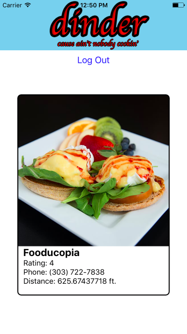

# dinderApp



Dinder is a Tinder-esque app that allows users to cycle through restaurants near them and use swipe functionality to 'Like' or 'Dislike' a venue. 

Users first create an account or login in order to use the app. They are then presented with possible 'matches' based off of their location. The matches are presented one at a time and the user can swipe right if they like the restaurant or swipe left if they do not.

## Technologies Used

React Native, Firebase

## Approach


## Installation instructions
```bash
# If you don't have React Native already:
brew install node
brew install watchman
npm install -g react-native-cli
```

```bash
git clone https://github.com/alexi-o/dinderApp
cd dinderApp
npm install

react-native run-ios
```
# [Link to my Trello](https://trello.com/b/BryHATza/dinder)
